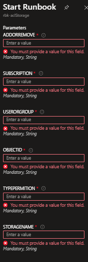

## infra-automationAccount-aclStorage

## v2

- Foi incluido no script v2 uma task para colocar o grupo que receberá permissão dentro de outro grupo que já esta na primeira camada. Motivação: existe limite de ACL em uma camada, e geralmente a primeira camada recebe muitos ACL e estoura o limite rápidamente, para que isso não aconteça a primeira camada/container, limita-se a um grupo onde receberá o usuário ou grupo para devida permissão.

- o ID do grupo é salvo em uma váriavel dentro do Automation account, porém é possível deixar fora, embora não recomendado.

## v1
- esse Script foi criado para facilitar o processo de permissionamento via ACL, utilizando o automation account. Todas variaveis são obrigatórias.

- A variavel SUBSCRIPTIONID foi guardada dentro de uma secret variável no Automation account, por conta disso existe o get-automationvariable. No caso de não utilizar, basta mudar a variavel para ir direto para o set-azcontext.

- O script é usado tanto para adicionar quanto para remover, basta especificar no processo de execução.

- Poderá ser colocar ou permissão de leitura ou permissão de escrita no path especificado.

- ObjectID é o ID do usuário ou do grupo a ser dado permissão.

- deverá ser escolhido entre user ou group, dependendo de quem receberá permissão

é possível adaptar para Azure devops, incluindo apenas um Yaml de validação e execução do script.
